* Table of Contents
{:toc}

--------------------------------------------------------------------------------------------------------------------

## **Acknowledgements**

* [Niklas Luhmann’s Zettelkasten note-taking method](https://www.cliffguren.com/articles/organic-notes-and-zettelkasten)
* Java NIO for file system operations
* SHA-256 hashing algorithm for deterministic ID generation
* Java ExecutorService for timeout handling in CI environments

--------------------------------------------------------------------------------------------------------------------

## **Setting up, getting started**

Refer to the guide [_Setting up and getting started_](SettingUp.md).

--------------------------------------------------------------------------------------------------------------------

## **Design**

<div markdown="span" class="alert alert-primary">

:bulb: **Tip:** The `.puml` files used to create diagrams are in this document `docs/diagrams` folder. Refer to the [_PlantUML Tutorial_ at se-edu/guides](https://se-education.org/guides/tutorials/plantUml.html) to learn how to create and edit diagrams.
</div>

### Architecture

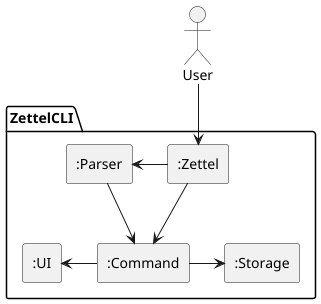

The ***Architecture Diagram*** given above explains the high-level design of Zettel.

The architecture of Zettel follows a command-pattern design with clear separation of concerns:

**Main components of the architecture:**

**`Zettel`** is the main entry point and orchestrator of the application.
* At app launch, it initializes UI, Storage, and loads existing notes from disk
* Manages the main application loop, reading user input and executing commands via Parser
* Implements timeout handling for CI/testing environments
* Handles graceful shutdown and resource cleanup

The bulk of the app's work is done by the following components:

* [**`UI`**](#ui-component): Handles all user interface interactions
* [**`Parser`**](#parser-component): Parses user input and creates Command objects
* [**`Command`**](#command-component): Executes specific operations on notes
* [**`Storage`**](#storage-component): Manages file system operations and persistence
* [**`Note`**](#note-component): Represents individual notes with metadata

**How the architecture components interact with each other:**

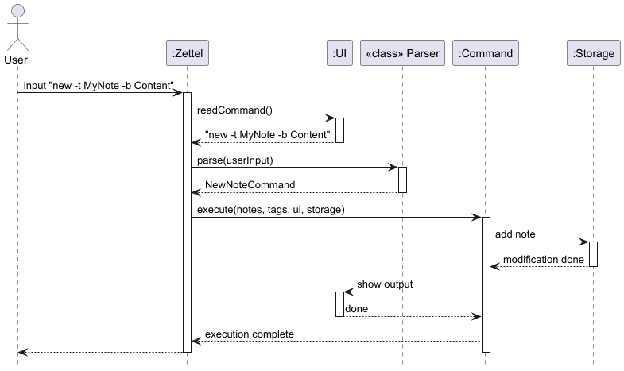

1. User enters command in terminal
2. `Zettel` reads input via `UI`
3. `Parser` parses the input and creates appropriate `Command` object
4. `Command` executes operation on `notes` list
5. `Storage` persists changes to disk
6. `UI` displays feedback to user

The sections below give more details of each component.

### UI component

**API**: `UI.java`

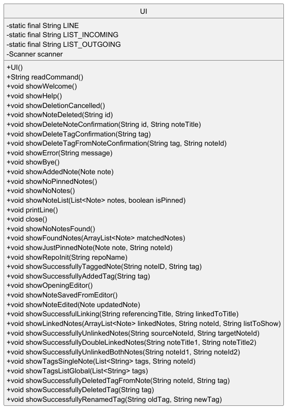

The `UI` component:
* Uses `Scanner` to read user input from the console
* Provides methods to display various types of feedback:
  - Welcome and help messages
  - Note lists (with filtering for pinned/archived notes)
  - Confirmation prompts for destructive operations
  - Error messages
  - Success messages for operations
* Formats output with consistent styling using line separators
* Manages the lifecycle of the Scanner resource

Key responsibilities:
* `readCommand()` - Reads user input from console
* `showWelcome()` - Displays welcome message and command list
* `showHelp()` - Lists all available commands
* `showNoteList()` - Displays notes with appropriate labels
* `showError()` - Displays error messages
* Various confirmation and success message methods

### Parser Component

**API**: `Parser.java`

The `Parser` component:
* Takes raw user input strings and converts them into executable `Command` objects
* Validates input format and parameters
* Extracts flags and arguments from commands
* Performs validation on note IDs (8-character hexadecimal format)
* Throws appropriate `ZettelException` subclasses for invalid input

Parsing workflow:
1. Split input by whitespace
2. Extract command keyword (first word)
3. Route to appropriate parse method via switch statement
4. Extract and validate parameters (flags, IDs, text)
5. Create and return specific Command object
6. Throw exception if validation fails

Key validation patterns:
* Note ID validation: Exactly 8 hexadecimal characters (a-f, 0-9)
* Flag validation: Recognizes `-f` (force), `-t` (title), `-b` (body), `-p` (pinned), `-a` (archived)
* Repository name validation: Alphanumeric, hyphens, and underscores only

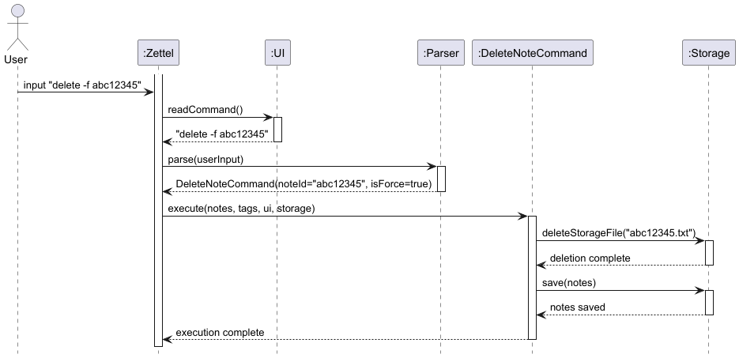

### Command Component

**API**: `Command.java`

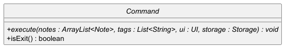

The `Command` component uses the Command Pattern where each command is an object that encapsulates:
* The action to perform
* The parameters needed
* The execution logic

All commands inherit from the abstract `Command` class and implement:
* `execute(ArrayList<Note> notes, List<String> tags, UI ui, Storage storage)` - Performs the command operation
* `isExit()` - Returns true only for ExitCommand

**Command Categories:**

1. **Note Management:**
   - `NewNoteCommand` - Creates new notes with hash-based IDs
   - `EditNoteCommand` - Opens notes in external editor
   - `DeleteNoteCommand` - Deletes notes with optional confirmation
   - `ArchiveNoteCommand` - Moves notes to/from archive folder
   - `PrintNoteBodyCommand` - Prints body of note to stdout

    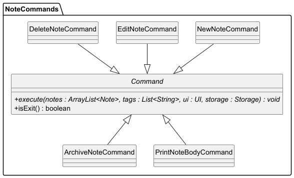

2. **Note Organization:**
   - `ListNoteCommand` - Lists notes with filtering options
   - `PinNoteCommand` - Pins/unpins notes for quick access
   - `FindNoteCommand` - Searches notes by keyword

    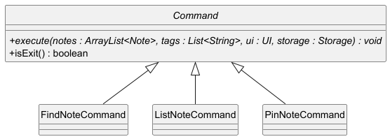

3. **Linking System:**
   - `LinkNotesCommand` - Creates unidirectional links
   - `UnlinkNotesCommand` - Removes unidirectional links
   - `LinkBothNotesCommand` - Creates bidirectional links
   - `UnlinkBothNotesCommand` - Removes bidirectional links
   - `ListLinkedNotesCommand` - Shows incoming/outgoing links

    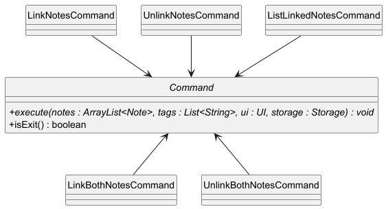

4. **Tagging System:**
   - `NewTagCommand` - Creates global tags
   - `TagNoteCommand` - Adds tag to note
   - `DeleteTagFromNoteCommand` - Removes tag from note
   - `DeleteTagGloballyCommand` - Removes tag from all notes
   - `RenameTagCommand` - Renames tag globally
   - `ListTagsGlobalCommand` - Lists all tags
   - `ListTagsSingleNoteCommand` - Lists tags for specific note

    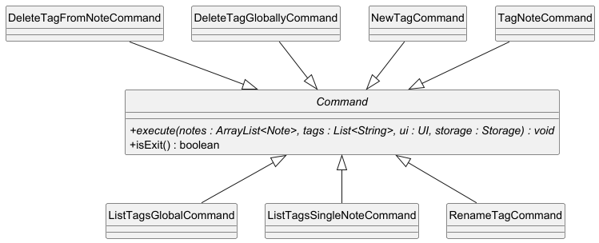

5. **System Commands:**
   - `InitCommand` - Initializes new repository
   - `ChangeRepoCommand` - Changes current note repo to another repo
   - `HelpCommand` - Displays help information
   - `ExitCommand` - Terminates application

    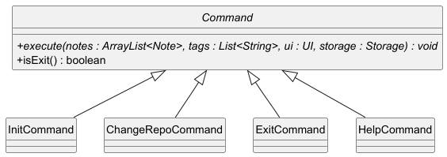

### Note Component

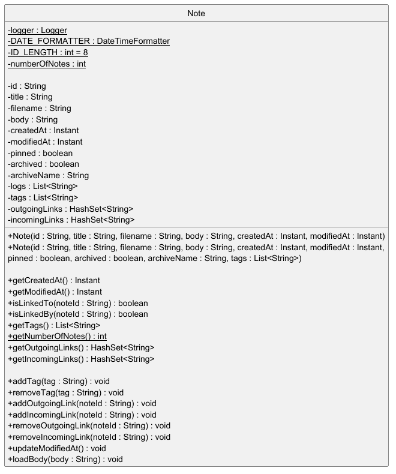

**API**: `Note.java`

The `Note` class represents a single note in the Zettel system:

**Key Fields:**
* `id` - 8-character hash-based unique identifier (immutable)
* `title` - Note title
* `filename` - Actual filename on disk (derived from title)
* `body` - Note content (stored separately in file system)
* `createdAt` - Creation timestamp (Instant)
* `modifiedAt` - Last modification timestamp (Instant)
* `pinned` - Boolean flag for pinned status
* `archived` - Boolean flag for archived status
* `archiveName` - Archive folder name (null if not archived)
* `tags` - List of tag strings
* `outgoingLinks` - HashSet of note IDs this note links to
* `incomingLinks` - HashSet of note IDs that link to this note

**Design Decisions:**

1. **Hash-based IDs**: IDs are generated deterministically using SHA-256 hash of (title + timestamp), ensuring uniqueness and reproducibility

2. **Separate body storage**: Note bodies are stored in separate `.txt` files rather than in the index file, allowing:
    - Efficient loading of note metadata without reading full bodies
    - Easy editing with external text editors
    - Better handling of large note contents

3. **Bidirectional linking**: Both incoming and outgoing links are tracked to enable:
    - Fast reverse link lookups
    - Efficient link cleanup when deleting notes
    - Graph-like navigation through notes

4. **Defensive copying**: Getter methods return defensive copies of mutable collections (tags, links) to prevent external modification

### Storage Component

**API**: `Storage.java`, `FileSystemManager.java`, `NoteSerializer.java`

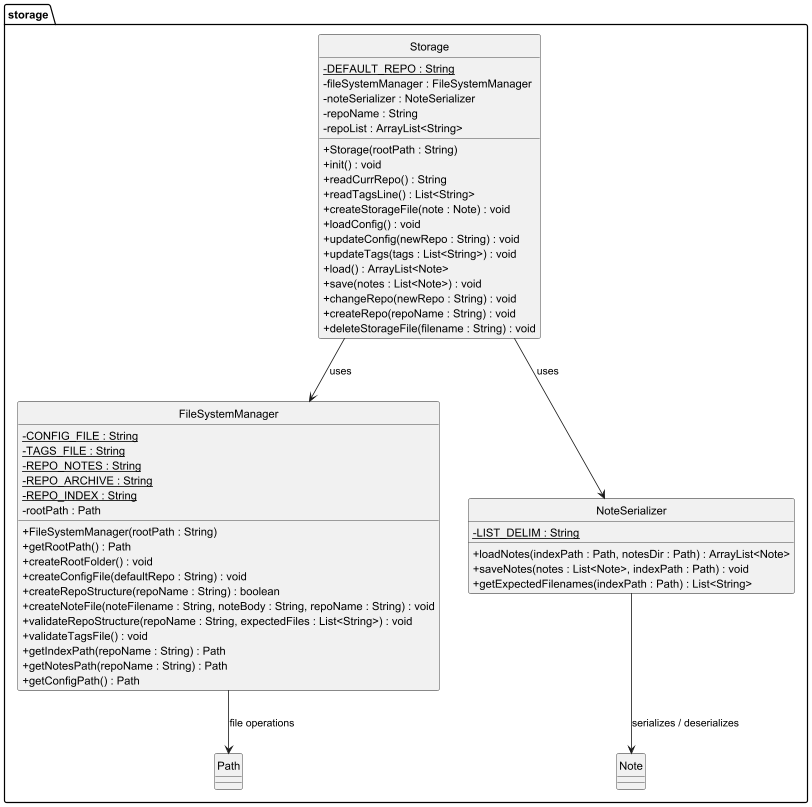

The Storage component is divided into three classes with distinct responsibilities:

#### Storage (Orchestrator)

Manages high-level storage operations and repository state:
* Maintains current repository name
* Coordinates file system and serialization operations
* Manages repository configuration
* Handles global tags file
* Provides paths to note files

#### FileSystemManager

Handles all file system operations:
* Creates and validates directory structure integrity
* Manages repository folders: `notes/`, `archive/`, `index.txt`
* Detects orphan files (files not referenced in index)
* Moves files between notes and archive directories

**Repository Structure:**
```
data/
├── .zettelConfig          # Repository list and current repo
├── tags.txt               # Global tags (one per line)
├── main/                  # Default repository
│   ├── index.txt          # Note metadata
│   ├── notes/             # Note body files
│   │   └── *.txt
│   └── archive/           # Archived note files
│       └── *.txt
└── [other-repos]/         # Additional repositories
```

#### NoteSerializer

Handles serialization/deserialization of Note objects:
* Converts Note objects to index file format (pipe-delimited)
* Parses index file lines back into Note objects
* Loads note bodies from separate text files
* Saves note metadata to index.txt

**Index File Format:**
```
ID | Title | Filename | CreatedAt | ModifiedAt | Pinned | Archived | ArchiveName | Tags | OutgoingLinks | IncomingLinks
```

Where:
* Pinned/Archived are `1` or `0`
* Tags and links are delimited by `;;`
* All fields are separated by ` | ` (space-pipe-space)

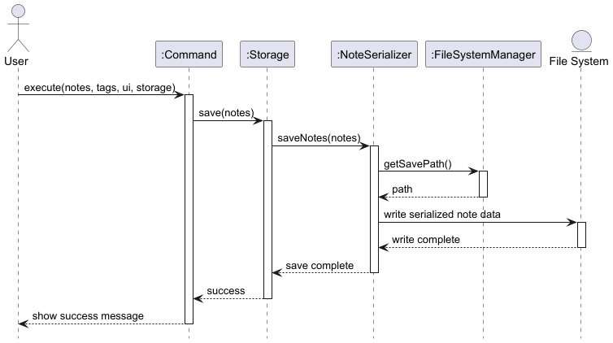

### Utility Components

#### IdGenerator

**API**: `IdGenerator.java`

Generates deterministic 8-character hexadecimal IDs:
* Uses SHA-256 hash of input string (title + timestamp)
* Takes first 4 bytes (8 hex characters) of hash
* Provides fallback method if SHA-256 unavailable
* Ensures all IDs are lowercase hex characters

#### EditorUtil

**API**: `EditorUtil.java`

Opens note files in external text editor:
* Checks for `$VISUAL` or `$EDITOR` environment variables
* Falls back to common CLI editors (vim, nano, vi)
* On Windows, tries notepad.exe
* Validates interactive console availability
* Waits for editor process to complete

--------------------------------------------------------------------------------------------------------------------

## **Implementation**

This section describes noteworthy implementation details for key features.

### Note Creation with Hash-Based IDs

**Design Choice: Deterministic ID Generation**

Unlike traditional incremental IDs or UUIDs, Zettel uses hash-based IDs generated from the note's title and creation timestamp. This is inspired from Git's commit hash.

**Implementation:**

```
ID = SHA-256(title + createdAt)[0:4] → 8 hex characters
```

**Rationale:**
* **Uniqueness**: SHA-256 collision probability is negligible for our use case
* **User-friendly**: 8 characters is short enough to type manually
* **No central counter**: No need to maintain global state across repositories

#### Design Considerations

**Aspect: How to assign unique note identifiers**

* **Alternative 1: (rejected)** Incremental integer IDs.
    * Pros: Simple, human-readable, easy to reference in commands.
    * Cons: Possible conflicts if multiple repositories are merged manually.

* **Alternative 2: (rejected)** Timestamp-based UUIDs.
    * Pros: Globally unique across repositories, supports synchronization.
    * Cons: Less readable and harder to manually type or recall.

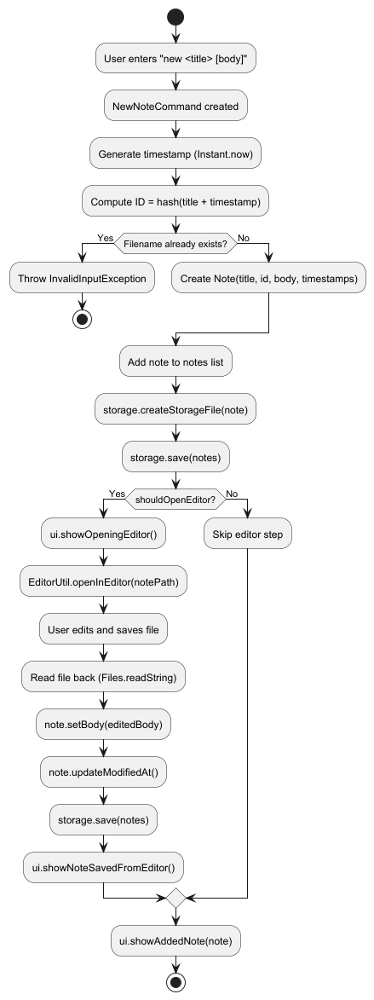

**Sequence:**
1. User provides title (and optional body)
2. `NewNoteCommand` captures current timestamp
3. `IdGenerator` hashes title+timestamp → 8-char ID
4. Filename derived from title (spaces substituted with underscores, append .txt)
5. Check for duplicate filename in existing notes
6. If body is null (no -b flag passed), open external editor for body input
7. Create `Note` object
8. Save to storage (both index.txt and body file)

### Linking System

**Design Choice: Bidirectional Link Tracking**

Notes maintain both outgoing and incoming link sets to enable efficient graph operations.

**Data Structure:**
```java
private HashSet<String> outgoingLinks;  // IDs this note links to
private HashSet<String> incomingLinks;  // IDs that link to this note
```

**Operations:**

1. **Link (Unidirectional):**
   - `sourceNote.addOutgoingLink(targetId)`
   - `targetNote.addIncomingLink(sourceId)`

2. **Link-Both (Bidirectional):**
   - Performs Link operation in both directions

3. **Unlink:**
   - Removes link from both source's outgoing and target's incoming

4. **Delete Note Cleanup:**
   - For each outgoing link: remove from target's incoming links
   - For each incoming link: remove from source's outgoing links

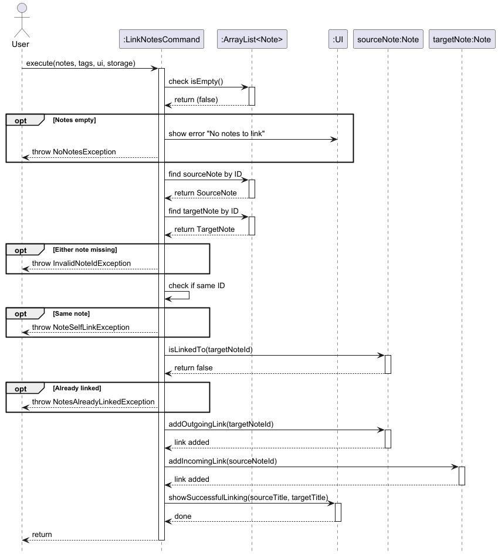

**Rationale:**
* O(1) lookup for "does note A link to note B?"
* O(1) retrieval of all incoming or outgoing links
* Automatic cleanup prevents dangling links
* Supports graph algorithms (BFS, DFS) for future features

#### Design Considerations

**Aspect: How note linking is represented**

* **Alternative 1 (current choice):** Use text-based note IDs stored in metadata.
    * Pros: Minimal overhead, links remain functional even if filenames change.
    * Cons: Broken links possible if IDs are deleted or recycled.

* **Alternative 2:** Use filename-based linking.
    * Pros: Intuitive for users browsing directly in the file system.
    * Cons: Breaks easily if note titles are renamed.

### Tag Management System

**Design Choice: Global Tag List + Note-Level Tags**

Tags are stored both globally (in `tags.txt`) and per-note (in `index.txt`).

**Architecture:**
* `tags.txt` - Master list of all existing tags (one per line)
* Each `Note` has a `List<String> tags` field
* Tags in note metadata are serialized as `tag1;;tag2;;tag3`

**Operations:**

1. **new-tag**: Adds tag to global list
2. **add-tag**: Adds existing global tag to specific note
3. **delete-tag**: Removes tag from specific note
4. **delete-tag-globally**: Removes tag from global list AND all notes
5. **rename-tag**: Renames tag globally across all notes

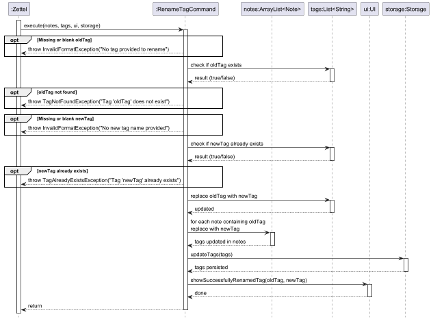

**Why Global Tag List?**
* Ensures consistency (no typos creating new tags)
* Enables tag autocomplete (future feature)
* Provides single source of truth for valid tags
* Simplifies tag management and cleanup

#### Design Considerations

**Aspect: How tags are stored and referenced**

* **Alternative 1 (current choice):** Store tags directly in each note file.
    * Pros: Simpler to parse, avoids dependency on central tag index.
    * Cons: Harder to rename or update tags globally across all notes.

* **Alternative 2:** Maintain a global tag registry containing all references.
    * Pros: Easier to enforce consistency and support global renaming.
    * Cons: Adds complexity and potential desync issues if index is corrupted.

### Archive System

**Design Choice: Separate Archive Directory**

Archived notes are physically moved to `archive/` subdirectory rather than just flagged.

**Structure:**
```
repo/
├── notes/          # Active notes
│   └── note1.txt
└── archive/        # Archived notes
    └── note2.txt
```

**Implementation:**

1. **Archive Operation:**
   - Set `note.archived = true`
   - Move file from `notes/` to `archive/`
   - Update index.txt with archived flag

2. **Unarchive Operation:**
   - Set `note.archived = false`
   - Move file from `archive/` back to `notes/`
   - Update index.txt

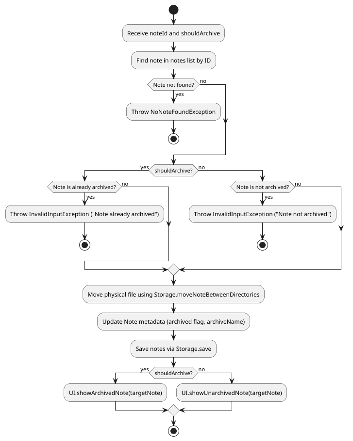

**Advantages:**
* Clear visual separation in file system
* Easy backup of active vs archived notes
* Reduces clutter in notes directory
* Metadata (index.txt) still tracks all notes

#### Design Considerations

**Aspect: How archived notes are handled**

* **Alternative 1 (current choice):** Move notes to a dedicated `/archive` directory.
    * Pros: Keeps active directory uncluttered, simple to restore.
    * Cons: Requires file I/O each time and can cause path issues if linked notes are moved.

* **Alternative 2:** Use only an “archived” flag in metadata instead of physical move.
    * Pros: Keeps links intact, avoids file system changes.
    * Cons: Requires more parsing logic and filtering in commands.

### Storage Validation and Recovery

**Design Choice: Robust Validation with Auto-Recovery**

Storage performs validation on every save and automatically repairs common issues.

**Validation Checks:**

1. **Directory Structure:**
   - Ensures `notes/`, `archive/`, `index.txt` exist
   - Creates missing directories/files

2. **Body File Validation:**
   - Checks each note listed in index.txt has corresponding body file
   - Creates empty body files for missing entries

3. **Orphan Detection:**
   - Identifies `.txt` files in notes/archive not referenced in index
   - Warns user but doesn't auto-delete

4. **Config File Validation:**
   - Ensures `.zettelConfig` exists
   - Validates current repository exists
   - Note: if `.zettelConfig` is forcibly removed by user, on validation a new default `.zettelConfig` is created; as such previously created repos are lost to the program.

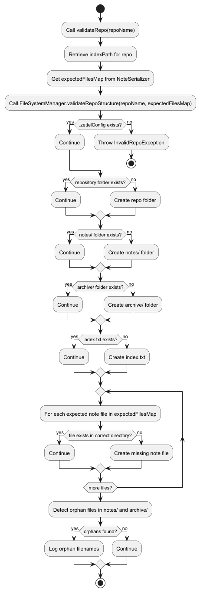

**Recovery Strategy:**
* Non-destructive: Never deletes data automatically
* Creates missing files with safe defaults (empty content)
* Warns about inconsistencies without blocking operations
* Allows manual intervention for orphaned files

### Editor Integration

**Design Choice: External Editor for Note Bodies**

Rather than implementing a built-in editor, Zettel opens notes in the user's preferred text editor.

**Editor Selection Priority:**
1. `$VISUAL` environment variable
2. `$EDITOR` environment variable
3. Common CLI editors: vim, nano, vi
4. Platform-specific: notepad.exe (Windows)

**Implementation:**

```java
Process process = new ProcessBuilder(editor, filepath)
    .inheritIO()
    .start();
int exitCode = process.waitFor();
```

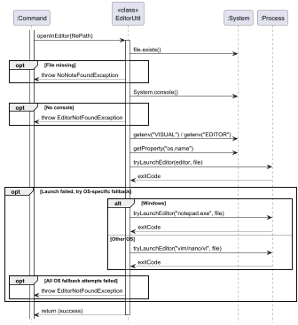

**Advantages:**
* Leverages user's existing editor preferences
* No need to implement complex text editing UI
* Supports advanced editing features (syntax highlighting, etc.)
* Works seamlessly in terminal environments

**Challenges:**
* Requires interactive console (doesn't work in IDE run mode)
* Must validate editor availability
* Need to handle editor process lifecycle

#### Design Considerations

**Aspect: How users edit notes**

* **Alternative 1 (current choice):** Invoke system default editor via environment variables (e.g. `$EDITOR`).
    * Pros: Respects user preferences, no external UI dependencies.
    * Cons: Dependent on correct environment configuration.

* **Alternative 2:** Embed a simple text editor inside the CLI.
    * Pros: Uniform behavior across systems.
    * Cons: Breaks minimalist philosophy; adds maintenance burden.

