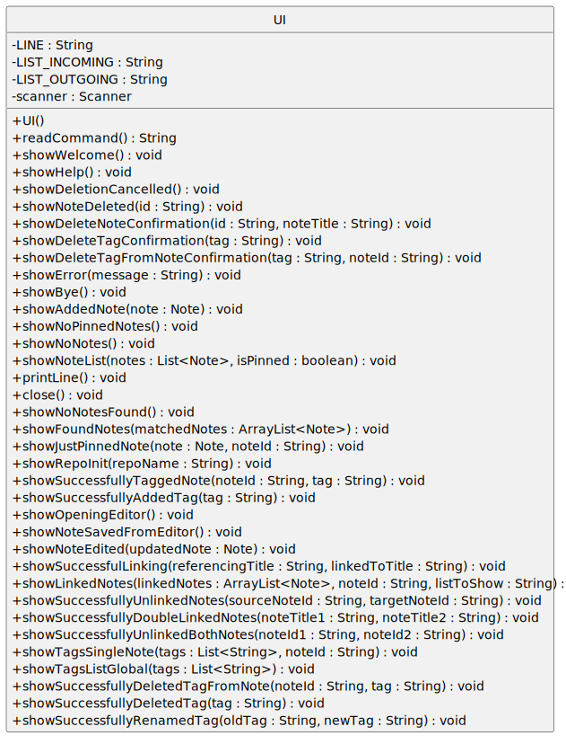
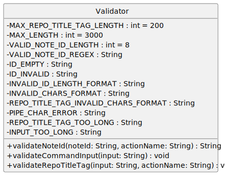
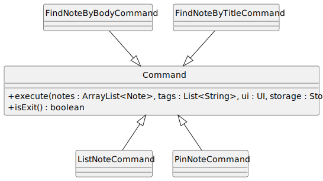
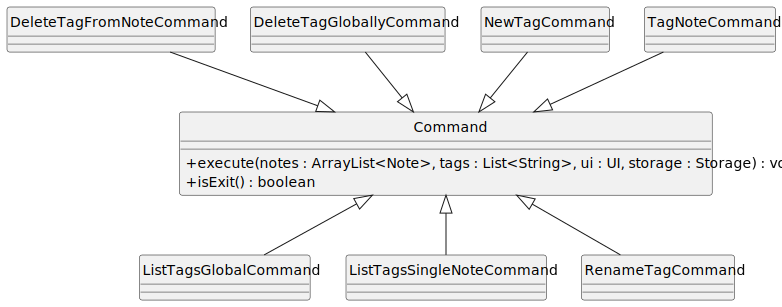
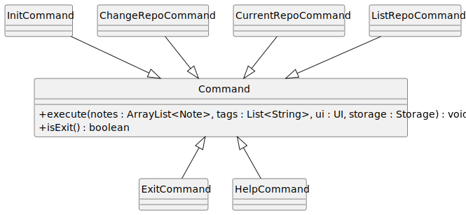
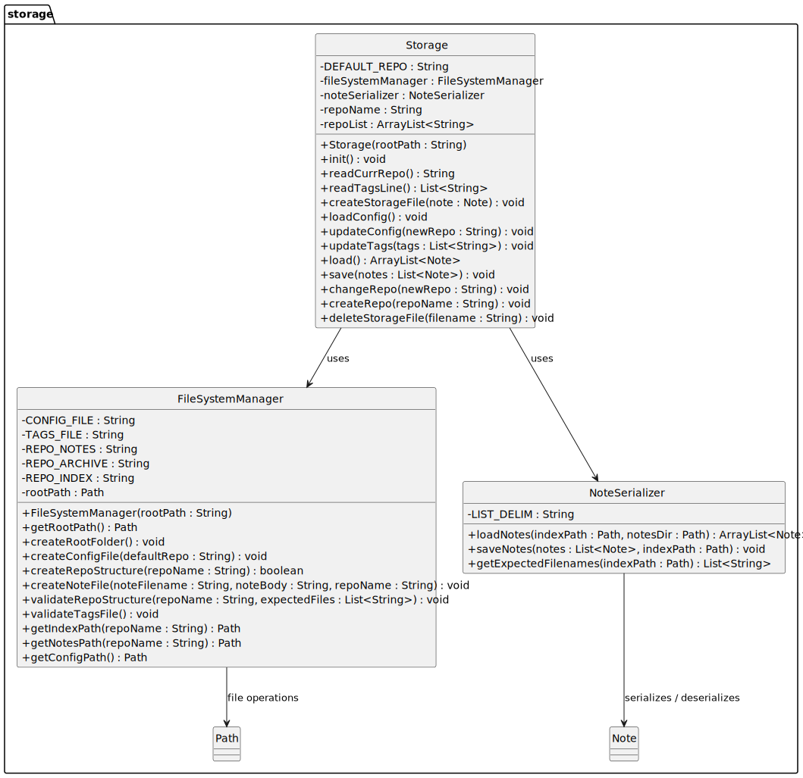
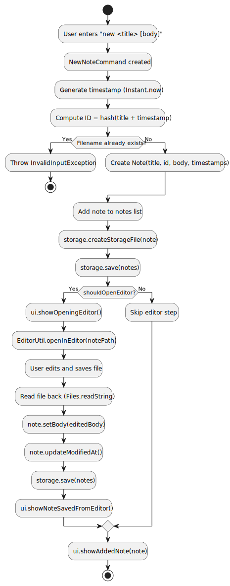
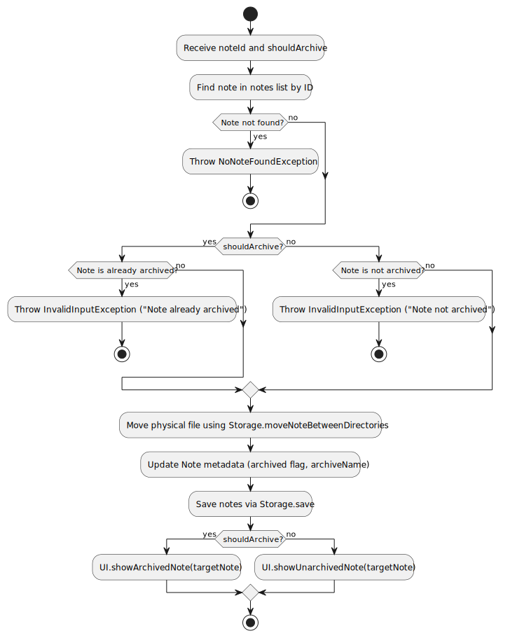
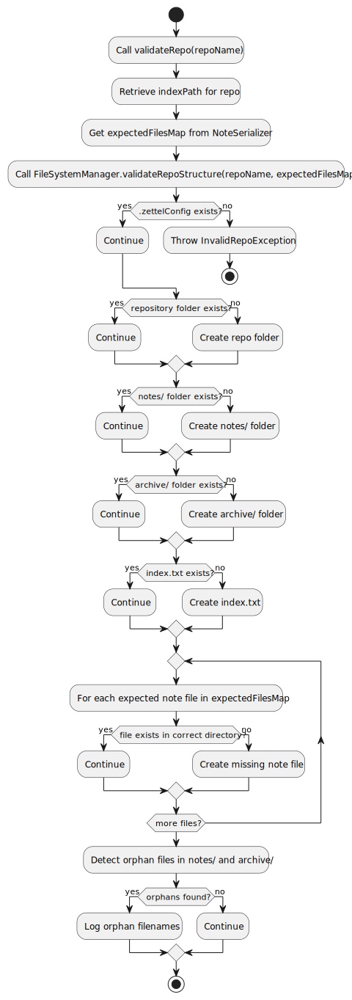

<link rel="stylesheet" href="/tp/print.css">

# **ZettelCLI Developer Guide**

* Table of Contents
{:toc}

--------------------------------------------------------------------------------------------------------------------

## **Acknowledgements**

* [Niklas Luhmann’s Zettelkasten note-taking method](https://www.cliffguren.com/articles/organic-notes-and-zettelkasten)
* Java NIO for file system operations
* SHA-256 hashing algorithm for deterministic ID generation
* Java ExecutorService for timeout handling in CI environments

--------------------------------------------------------------------------------------------------------------------

## **Setting up, getting started**

Refer to the guide [_Setting up and getting started_](SettingUp.md).

--------------------------------------------------------------------------------------------------------------------

## **Design**

### Architecture


The ***Architecture Diagram*** given above explains the high-level design of Zettel.

The architecture of Zettel follows a command-pattern design with clear separation of concerns:

**Main components of the architecture:**

**`Zettel`** is the main entry point and orchestrator of the application.
* At app launch, it initializes UI, Storage, and loads existing notes from disk
* Manages the main application loop, reading user input and executing commands via Parser
* Implements timeout handling for CI/testing environments
* Handles graceful shutdown and resource cleanup

The bulk of the app's work is done by the following components:

* [**`UI`**](#ui-component): Handles all user interface interactions
* [**`Parser`**](#parser-component): Parses user input and creates Command objects
* [**`Validator`**](#validator-component): Validates user input for Parser
* [**`Command`**](#command-component): Executes specific operations on notes
* [**`Storage`**](#storage-component): Manages file system operations and persistence
* [**`Note`**](#note-component): Represents individual notes with metadata

**How the architecture components interact with each other:**


1. User enters command in terminal
2. `Zettel` reads input via `UI`
3. `Parser` parses the input and 
4. `Validator` validates input parameters (IDs, names, etc.)
5. `Parser` creates appropriate `Command` object
6. `Command` executes operation on `notes` list
7. `Storage` persists changes to disk
8. `UI` displays feedback to user

The sections below give more details of each component.

### UI component

**API**: `UI.java`



The `UI` component:
* Uses `Scanner` to read user input from the console
* Provides methods to display various types of feedback:
  - Welcome and help messages
  - Note lists (with filtering for pinned/archived notes)
  - Confirmation prompts for destructive operations
  - Error messages
  - Success messages for operations
* Formats output with consistent styling using line separators
* Manages the lifecycle of the Scanner resource

Key responsibilities:
* `readCommand()` - Reads user input from console
* `showWelcome()` - Displays welcome message and command list
* `showHelp()` - Lists all available commands
* `showNoteList()` - Displays notes with appropriate labels
* `showError()` - Displays error messages
* Various confirmation and success message methods

### Parser Component

**API**: `Parser.java`

The `Parser` component:
* Takes raw user input strings and converts them into executable `Command` objects
* Validates input format and parameters (e.g note IDs) using `Validator`
* Extracts flags and arguments from commands
* Throws appropriate `ZettelException` subclasses for invalid input

Parsing workflow:
1. Split input by whitespace
2. Extract command keyword (first word)
3. Route to appropriate parse method via switch statement
4. Extract and validate parameters (flags, IDs, text)
5. Create and return specific Command object
6. Throw exception if validation fails


### Validator Component

**API**: `Validator.Java`



The `Validator` class provides centralized validation logic for various input types.

**Key Validation Methods:**

1. **Note ID Validation:**
    - Ensures exactly 8 lowercase hexadecimal characters (a-f, 0-9)
    - Throws `InvalidFormatException` if invalid

2. **Command Input Validation:**
    - Bans usage of `` | `` in input
    - Ensures input contains only ASCII characters
    - Ensures input is not longer than 3000 characters
    - Throws `ForbiddenCharacterFoundException` or `LengthExceedException` appropriately

3. **Repo Title Validation:**
    - Ensures input title only contains alphanumeric characters or spaces
    - Ensures input is not longer than 200 characters
    - Throws `InvalidFormatException` or `LengthExceedException` appropriately

**Design Rationale:**

- Separation of Concerns: Moves validation logic out of Parser class
- Reusability: Validation methods can be called from multiple commands
- Maintainability: Single source of truth for validation rules
- Testability: Easier to unit test validation in isolation

### Command Component

**API**: `Command.java`


The `Command` component uses the Command Pattern where each command is an object that encapsulates:
* The action to perform
* The parameters needed
* The execution logic

All commands inherit from the abstract `Command` class and implement:
* `execute(ArrayList<Note> notes, List<String> tags, UI ui, Storage storage)` - Performs the command operation
* `isExit()` - Returns true only for ExitCommand

**Command Categories:**

1. **Note Management:**
   - `NewNoteCommand` - Creates new notes with hash-based IDs
   - `EditNoteCommand` - Opens notes in external editor
   - `DeleteNoteCommand` - Deletes notes with optional confirmation
   - `ArchiveNoteCommand` - Moves notes to/from archive folder
   - `PrintNoteBodyCommand` - Prints body of note to stdout

    

2. **Note Organization:**
   - `ListNoteCommand` - Lists notes with filtering options
   - `PinNoteCommand` - Pins/unpins notes for quick access
   - `FindNoteByTitleCommand` - Searches notes by title
   - `FindNoteByBodyCommand` - Searches note by body content

    

3. **Linking System:**
   - `LinkNotesCommand` - Creates unidirectional links
   - `UnlinkNotesCommand` - Removes unidirectional links
   - `LinkBothNotesCommand` - Creates bidirectional links
   - `UnlinkBothNotesCommand` - Removes bidirectional links
   - `ListLinkedNotesCommand` - Shows incoming/outgoing links

    

4. **Tagging System:**
   - `NewTagCommand` - Creates global tags
   - `TagNoteCommand` - Adds tag to note
   - `DeleteTagFromNoteCommand` - Removes tag from note
   - `DeleteTagGloballyCommand` - Removes tag from all notes
   - `RenameTagCommand` - Renames tag globally
   - `ListTagsGlobalCommand` - Lists all tags
   - `ListTagsSingleNoteCommand` - Lists tags for specific note

    

5. **Repository/System Commands**
    - `InitCommand` - Initializes new repository
    - `ChangeRepoCommand` - Changes current note repo to another repo
    - `CurrentRepoCommand` - Displays current repo name
    - `ListRepoCommand` - Lists all repos
    - `HelpCommand` - Displays help information
    - `ExitCommand` - Terminates application

    

### Note Component


**API**: `Note.java`

The `Note` class represents a single note in the Zettel system:

**Key Fields:**
* `id` - 8-character hash-based unique identifier (immutable)
* `title` - Note title
* `filename` - Actual filename on disk (derived from title)
* `body` - Note content (stored separately in file system)
* `createdAt` - Creation timestamp (Instant)
* `modifiedAt` - Last modification timestamp (Instant)
* `isPinned` - Boolean flag for pinned status
* `isArchived` - Boolean flag for archived status
* `archiveName` - Archive folder name (null if not archived)
* `tags` - List of tag strings
* `outgoingLinks` - HashSet of note IDs this note links to
* `incomingLinks` - HashSet of note IDs that link to this note

**Design Decisions:**

1. **Hash-based IDs**: IDs are generated deterministically using SHA-256 hash of (title + timestamp), ensuring uniqueness and reproducibility

2. **Separate body storage**: Note bodies are stored in separate `.txt` files rather than in the index file, allowing:
    - Efficient loading of note metadata without reading full bodies
    - Easy editing with external text editors
    - Better handling of large note contents

3. **Bidirectional linking**: Both incoming and outgoing links are tracked to enable:
    - Fast reverse link lookups
    - Efficient link cleanup when deleting notes
    - Graph-like navigation through notes

4. **Defensive copying**: Getter methods return defensive copies of mutable collections (tags, links) to prevent external modification

### Storage Component

**API**: `Storage.java`, `FileSystemManager.java`, `NoteSerializer.java`



The Storage component is divided into three classes with distinct responsibilities:

#### Storage (Orchestrator)

Manages high-level storage operations and repository state:
* Maintains current repository name
* Coordinates file system and serialization operations
* Manages repository configuration
* Handles global tags file
* Provides paths to note files

#### FileSystemManager

Handles all file system operations:
* Creates and validates directory structure integrity
* Manages repository folders: `notes/`, `archive/`, `index.txt`
* Detects orphan files (files not referenced in index)
* Moves files between notes and archive directories

**Repository Structure:**
```
data/
├── .zettelConfig          # Repository list and current repo
├── tags.txt               # Global tags (one per line)
├── main/                  # Default repository
│   ├── index.txt          # Note metadata
│   ├── notes/             # Note body files
│   │   └── *.txt
│   └── archive/           # Archived note files
│       └── *.txt
└── [other-repos]/         # Additional repositories
```

#### NoteSerializer

Handles serialization/deserialization of Note objects:
* Converts Note objects to index file format (pipe-delimited)
* Parses index file lines back into Note objects
* Loads note bodies from separate text files
* Saves note metadata to index.txt

**Index File Format:**
```
ID | Title | Filename | CreatedAt | ModifiedAt | isPinned | isArchived | ArchiveName | Tags | OutgoingLinks | 
IncomingLinks
```
* Note: IncomingLinks is on the same line as the others in the index file, line break shown due to 
space constraints within this PDF.

Where:
* isPinned/isArchived are `1` or `0`
* Tags and links are delimited by `;;`
* All fields are separated by `` | `` (space-pipe-space)


### Utility Components

#### IdGenerator

**API**: `IdGenerator.java`

Generates deterministic 8-character hexadecimal IDs:
* Uses SHA-256 hash of input string (title + timestamp)
* Takes first 4 bytes (8 hex characters) of hash
* Provides fallback method if SHA-256 unavailable
* Ensures all IDs are lowercase hex characters

#### EditorUtil

**API**: `EditorUtil.java`

Opens note files in external text editor:
* Checks for `$VISUAL` or `$EDITOR` environment variables
* Falls back to common CLI editors (vim, nano, vi)
* On Windows, tries notepad.exe
* Validates interactive console availability
* Waits for editor process to complete

--------------------------------------------------------------------------------------------------------------------

## **Implementation**

This section describes noteworthy implementation details for key features.

### Note Creation with Hash-Based IDs

**Design Choice: Deterministic ID Generation**

Unlike traditional incremental IDs or UUIDs, Zettel uses hash-based IDs generated from the note's title and creation timestamp. This is inspired from Git's commit hash.

**Implementation:**

```
ID = SHA-256(title + createdAt)[0:4] → 8 hex characters
```

**Rationale:**
* **Uniqueness**: SHA-256 collision probability is negligible for our use case
* **User-friendly**: 8 characters is short enough to type manually
* **No central counter**: No need to maintain global state across repositories

#### Design Considerations

**Aspect: How to assign unique note identifiers**

* **Alternative 1: (rejected)** Incremental integer IDs.
    * Pros: Simple, human-readable, easy to reference in commands.
    * Cons: Possible conflicts if multiple repositories are merged manually.

* **Alternative 2: (rejected)** Timestamp-based UUIDs.
    * Pros: Globally unique across repositories, supports synchronization.
    * Cons: Less readable and harder to manually type or recall.



**Sequence:**
1. User provides title (and optional body)
2. `NewNoteCommand` captures current timestamp
3. `IdGenerator` hashes title+timestamp → 8-char ID
4. Filename derived from title (spaces substituted with underscores, append .txt)
5. Check for duplicate filename in existing notes
6. If body is null (no -b flag passed), open external editor for body input
7. Create `Note` object
8. Save to storage (both index.txt and body file)

### Linking System

**Design Choice: Bidirectional Link Tracking**

Notes maintain both outgoing and incoming link sets to enable efficient graph operations.

**Data Structure:**
```java
private HashSet<String> outgoingLinks;  // IDs this note links to
private HashSet<String> incomingLinks;  // IDs that link to this note
```

**Operations:**

1. **Link (Unidirectional):**
   - `sourceNote.addOutgoingLink(targetId)`
   - `targetNote.addIncomingLink(sourceId)`

2. **Link-Both (Bidirectional):**
   - Performs Link operation in both directions

3. **Unlink:**
   - Removes link from both source's outgoing and target's incoming

4. **Delete Note Cleanup:**
   - For each outgoing link: remove from target's incoming links
   - For each incoming link: remove from source's outgoing links


**Rationale:**
* O(1) lookup for "does note A link to note B?"
* O(1) retrieval of all incoming or outgoing links
* Automatic cleanup prevents dangling links
* Supports graph algorithms (BFS, DFS) for future features

#### Design Considerations

**Aspect: How note linking is represented**

* **Alternative 1 (current choice):** Use text-based note IDs stored in metadata.
    * Pros: Minimal overhead, links remain functional even if filenames change.
    * Cons: Broken links possible if IDs are deleted or recycled.

* **Alternative 2:** Use filename-based linking.
    * Pros: Intuitive for users browsing directly in the file system.
    * Cons: Breaks easily if note titles are renamed.

### Tag Management System

**Design Choice: Global Tag List + Note-Level Tags**

Tags are stored both globally (in `tags.txt`) and per-note (in `index.txt`).

**Architecture:**
* `tags.txt` - Master list of all existing tags (one per line)
* Each `Note` has a `List<String> tags` field
* Tags in note metadata are serialized as `tag1;;tag2;;tag3`

**Operations:**

1. **new-tag**: Adds tag to global list
2. **add-tag**: Adds a tag to a specific note. Also creates the tag if it does not yet exist on the global list.
3. **delete-tag**: Removes tag from specific note
4. **delete-tag-globally**: Removes tag from global list AND all notes
5. **rename-tag**: Renames tag globally across all notes


**Why Global Tag List?**
* Ensures consistency (no typos creating new tags)
* Enables tag autocomplete (future feature)
* Provides single source of truth for valid tags
* Simplifies tag management and cleanup

#### Design Considerations

**Aspect: How tags are stored and referenced**

* **Alternative 1 (current choice):** Store tags directly in each note file.
    * Pros: Simpler to parse, avoids dependency on central tag index.
    * Cons: Harder to rename or update tags globally across all notes.

* **Alternative 2:** Maintain a global tag registry containing all references.
    * Pros: Easier to enforce consistency and support global renaming.
    * Cons: Adds complexity and potential desync issues if index is corrupted.

### Archive System

**Design Choice: Separate Archive Directory**

Archived notes are physically moved to `archive/` subdirectory rather than just flagged, and can no longer be edited.

**Structure:**
```
repo/
├── notes/          # Active notes
│   └── note1.txt
└── archive/        # Archived notes
    └── note2.txt
```

**Implementation:**

1. **Archive Operation:**
   - Set `note.isArchived = true`
   - Move file from `notes/` to `archive/`
   - Update index.txt with archived flag

2. **Unarchive Operation:**
   - Set `note.isArchived = false`
   - Move file from `archive/` back to `notes/`
   - Update index.txt



**Advantages:**
* Clear visual separation in file system
* Easy backup of active vs archived notes
* Reduces clutter in notes directory
* Metadata (index.txt) still tracks all notes

#### Design Considerations

**Aspect: How archived notes are handled**

* **Alternative 1 (current choice):** Move notes to a dedicated `/archive` directory.
    * Pros: Keeps active directory uncluttered, simple to restore.
    * Cons: Requires file I/O each time and can cause path issues if linked notes are moved.

* **Alternative 2:** Use only an “archived” flag in metadata instead of physical move.
    * Pros: Keeps links intact, avoids file system changes.
    * Cons: Requires more parsing logic and filtering in commands.

### Repository Management System

**Design Choice: Multiple Independent Repositories**

Users can create and switch between multiple isolated repositories, each with its own notes, index, and archive.

**Structure:**
```
data/
├── .zettelConfig          # Repository configuration file
├── tags.txt               # Global tags (shared across all repos)
├── main/                  # Default repository
│   ├── index.txt
│   ├── notes/
│   └── archive/
├── project1/              # Additional repositories
│   ├── index.txt
│   ├── notes/
│   └── archive/
└── research/
    ├── index.txt
    ├── notes/
    └── archive/
```

**Configuration File Format (`.zettelConfig`):**
```
<repo1> | <repo2> | ...
<current-repo-name>
```
- **First line:** List of all repositories, pipe-separated
- **Second line:** Current active repository

#### Operations

1. **InitCommand:**

- Creates new repository directory structure
- Adds repository name to first line of `.zettelConfig` (if not exists)
- Does **not** switch to new repository

2. **ChangeRepoCommand:**

- Validates repository exists
- Updates second line of `.zettelConfig`
- Reloads notes from new repository

3. **CurrentRepoCommand:**

- Reads second line from `.zettelConfig`
- Displays current repository name

4. **ListRepoCommand:**

- Parses first line of `.zettelConfig`
- Displays numbered list of repositories

#### Advantages

* Complete isolation between projects
* Easy to archive entire projects
* Simple file-based configuration
* No cross-repository dependencies

> **Note:** Tags are global across all repositories (stored in `data/tags.txt`), while notes and links are repository-specific.

#### Design Considerations

**Aspect: How to manage multiple repositories**

* **Alternative 1 (current choice):** Separate directories with centralized config file
    * Pros: Complete isolation, simple structure, easy backup per project
    * Cons: Must manually switch repositories, no cross-repo features

* **Alternative 2:** Single directory with repository field in each note
    * Pros: No switching needed, can link across repositories
    * Cons: More complex queries, easier to corrupt, harder to backup individually

### Storage Validation and Recovery

**Design Choice: Robust Validation with Auto-Recovery**

Storage performs validation on every save and automatically repairs common issues.

**Validation Checks:**

1. **Directory Structure:**
   - Ensures `notes/`, `archive/`, `index.txt` exist
   - Creates missing directories/files

2. **Body File Validation:**
   - Checks each note listed in index.txt has corresponding body file
   - Creates empty body files for missing entries

3. **Orphan Detection:**
   - Identifies `.txt` files in notes/archive not referenced in index
   - Warns user but doesn't auto-delete

4. **Config File Validation:**
   - Ensures `.zettelConfig` exists
   - Validates current repository exists
   - Note: if `.zettelConfig` is forcibly removed by user, on validation a new default `.zettelConfig` is created; as such previously created repos are lost to the program.



**Recovery Strategy:**
* Non-destructive: Never deletes data automatically
* Creates missing files with safe defaults (empty content)
* Warns about inconsistencies without blocking operations
* Allows manual intervention for orphaned files

### Editor Integration

**Design Choice: External Editor for Note Bodies**

Rather than implementing a built-in editor, Zettel opens notes in the user's preferred text editor.

**Editor Selection Priority:**
1. `$VISUAL` environment variable
2. `$EDITOR` environment variable
3. Platform-specific: notepad.exe (Windows)
4. Common CLI editors: vim, nano, vi

**Implementation:**

```java
Process process = new ProcessBuilder(editor, filepath)
    .inheritIO()
    .start();
int exitCode = process.waitFor();
```


**Advantages:**
* Leverages user's existing editor preferences
* No need to implement complex text editing UI
* Supports advanced editing features (syntax highlighting, etc.)
* Works seamlessly in terminal environments

**Challenges:**
* Requires interactive console (doesn't work in IDE run mode)
* Must validate editor availability
* Need to handle editor process lifecycle

#### Design Considerations

**Aspect: How users edit notes**

* **Alternative 1 (current choice):** Invoke system default editor via environment variables (e.g. `$EDITOR`).
    * Pros: Respects user preferences, no external UI dependencies.
    * Cons: Dependent on correct environment configuration.

* **Alternative 2:** Embed a simple text editor inside the CLI.
    * Pros: Uniform behavior across systems.
    * Cons: Breaks minimalist philosophy; adds maintenance burden.

--------------------------------------------------------------------------------------------------------------------

## **Documentation, Testing, Configuration**

### Documentation Guidelines

* Use Javadoc for all public classes and methods
* Include `@param`, `@return`, and `@throws` annotations
* Document design decisions in class-level Javadoc
* Keep comments concise and focused on "what" and "why", not "how"

### Testing Recommendations

**Unit Tests:**
* Test individual Command classes with mock data
* Test Parser and Validator logic extensively
* Test ID generation for deterministic behavior
* Test serialization/deserialization round-trips

**Integration Tests:**
* Test command execution with real Storage
* Test file system operations
* Test link cleanup on note deletion
* Test tag rename propagation

**System Tests:**
* Test full user workflows (create → edit → link → delete)
* Test repository switching
* Test archive operations
* Test error recovery scenarios

### Configuration

The application uses minimal configuration:
* `.zettelConfig` - Stores repository list and current repository
* `tags.txt` - Global tag list
* Environment variables: `$VISUAL`, `$EDITOR` for editor selection

--------------------------------------------------------------------------------------------------------------------

## **Appendix: Requirements**

### Product Scope

**Target user profile:**
* Students, researchers, or knowledge workers who need to manage interconnected notes
* Users comfortable with command-line interfaces
* Users who prefer keyboard-driven workflows
* Users who want a lightweight, portable note-taking system
* Users familiar with Zettelkasten methodology

**Value proposition:**
* Fast, keyboard-driven note creation and navigation
* Bidirectional linking for creating knowledge graphs
* Deterministic IDs for reproducible note references
* File-based storage (no lock-in, easy backup)
* Multiple repositories for organizing different projects
* Archive system for managing completed work

### User Stories

Priorities: High (must have) - `***`, Medium (nice to have) - `**`, Low (unlikely to have) - `*`

| Priority  | As a...              | I want to...                                   | So that I can...                                         |
|-----------|----------------------|------------------------------------------------|----------------------------------------------------------|
| `***`     | impatient user       | create notes quickly from the CLI              | capture ideas instantly without relying on external apps |
| `***`     | hurried user         | create a note with only a title                | jot down ideas and fill in details later                 |
| `***`     | disorganised person  | list and review all my notes                   | have a single, searchable place for all my thoughts      |
| `***`     | cautious user        | confirm before deleting a note                 | avoid accidentally losing important information          |
| `***`     | user                 | search notes by title or keyword               | find specific ideas or topics quickly                    |
| `**`      | minimalist user      | keep all notes in a flat directory structure   | avoid unnecessary complexity or folder clutter           |
| `**`      | user                 | tag notes with multiple categories             | organise and filter my notes by topic or theme           |
| `**`      | user                 | link notes together                            | build a network of related ideas                         |
| `**`      | user                 | view linked notes from both directions         | understand the relationships between connected notes     |
| `**`      | power user           | edit note bodies using my preferred editor     | stay productive using familiar text-editing tools        |
| `*`       | heavy user           | archive old or inactive notes                  | keep my active workspace clean and focused               |
| `*`       | nostalgic user       | view each note’s creation date                 | trace when and how my ideas evolved over time            |

### Non-Functional Requirements

1. **Portability**: Should work on any mainstream OS (Windows, macOS, Linux) with Java 17+
2. **Performance**: Should handle up to 10,000 notes without noticeable lag
3. **Reliability**: Should never lose data even if application crashes
4. **Usability**: Command syntax should be memorable and consistent
5. **Maintainability**: Code should follow object-oriented principles with clear separation of concerns
6. **Data Integrity**: Should detect and warn about orphaned files or missing body files
7. **Recoverability**: Should automatically repair common storage issues
8. **Testability**: Should support timeout-based testing for CI environments

### Glossary

* **Zettelkasten**: A method of note-taking and knowledge management based on linking atomic notes
* **Note ID**: An 8-character hexadecimal identifier generated from note title and creation time
* **Validator**: Utility class that performs input validation before command execution
* **Repository**: A collection of notes stored in a single directory (can have multiple repositories)
* **Current Repository**: The active repository where new notes are created and commands are executed
* **Repository List**: Collection of all initialized repositories stored in .zettelConfig
* **Index file**: `index.txt` containing metadata for all notes in pipe-delimited format
* **Body file**: Separate `.txt` file containing the actual content of a note
* **Outgoing link**: A link from the current note to another note
* **Incoming link**: A link from another note to the current note
* **Orphan file**: A body file that exists in notes/ or archive/ but isn't referenced in index.txt
* **Force flag** (`-f`): Skips confirmation prompts for destructive operations

--------------------------------------------------------------------------------------------------------------------

## **Appendix: Instructions for Manual Testing**

### Launch and Shutdown

1. **Initial launch**
    - Ensure Java 17+ is installed
    - Run: `java -jar zettel.jar`
    - Expected: Welcome message displays with command list, `data/main/` directory created

2. **Graceful shutdown**
    - Execute: `bye`
    - Expected: Application exits, all data saved

3. **Timeout handling** (CI environments)
    - Run without input for 240 seconds
    - Expected: Application times out gracefully with message

### Creating and editing notes

1. **Create note with title and body**
   - Command: `new -t Test-Note -b This is test content`
   - Expected: Note created with 8-char ID, confirmation message displayed

2. **Create note with title only** (requires interactive editor)
   - Command: `new -t hello`
   - Expected: External editor opens, saving and closing editor saves note

3. **Create duplicate filename**
   - Create: `new -t Same Title -b First`
   - Try: `new -t Same Title -b Second`
   - Expected: Error message about existing note

4. **Edit existing note**
   - Edit: `edit <note-id>`
   - Expected: External editor opens, saving and closing editor saves note

### Listing and Searching

1. **List all unarchived notes**
   - Command: `list`
   - Expected: All unarchived notes displayed with filename, date, and ID, regardless of its pinned state.

2. **List all unarchived notes that are pinned only**
   - Pin a note: `pin <note-id>`
   - Command: `list -p`
   - Expected: Only unarchived notes that are pinned shown.

3. **List archived only**
   - Archive a note: `archive <note-id>`
   - Command: `list -a`
   - Expected: Only archived notes shown, regardless of its pinned state.

4. **List all archived that are pinned only**
    - Command: `list -a -p` or `list -p -a`
    - Expected: Only archived notes that are pinned shown.

5. **Search note bodies**
   - Command: `find-note-by-body test`
   - Expected: All notes with body containing "test" (case-insensitive) displayed
 
6. **Search note titles**
   - Command: `find-note-by-title test`
   - Expected: All notes with title containing "test" (case-insensitive) displayed

### Linking Notes

1. **Create unidirectional link**
   - Create two notes, get their IDs
   - Command: `link <source-id> <target-id>`
   - Expected: Confirmation message

2. **Create bidirectional link**
   - Command: `link-both <id1> <id2>`
   - Expected: Both directions linked with message

3. **List incoming links**
   - Command: `list-incoming-links <note-id>`
   - Expected: All notes linking to this note displayed

4. **List outgoing links**
   - Command: `list-outgoing-links <note-id>`
   - Expected: All notes this note links to displayed

5. **Unlink a note with links**
   - Command: `unlink <source-id> <target-id>`
   - Expected: One-way link from source note to target note removed with message

6. **Unlink 2 notes in both directions**
   - Command: `unlink-both <source-id> <target-id>`
   - Expected: All existing links between 2 notes are broken. 

6. **Delete note with links**
   - Delete a linked note
   - Check linked notes with `list-incoming-links` and/or `list-outgoing-links`
   - Expected: All links cleaned up automatically

### Repository Management

1. **View current repository**
   - Command: `current-repo`
   - Expected: Display current repository name (e.g main)

2. **List all repositories**
   - Create multiple repos: `init repo1`, `init repo2`
   - Command: `list-repos`
   - Expected: Numbered list showing all repositories 

3. **Switch to non-existent repository**
   - Command: `change-repo nonexistent`
   - Expected: Error message about repository not existing
 
### Tag Management

1. **Create global tag**
   - Command: `new-tag project`
   - Expected: Tag added to global list

2. **Add tag to note**
   - Command: `add-tag <note-id> project`
   - Expected: Tag added to note. If the tag did not originally exist globally, a new tag will be created.

3. **List all tags**
   - Command: `list-tags-all`
   - Expected: All global tags displayed

4. **List tags for note**
   - Command: `list-tags <note-id>`
   - Expected: Tags for specific note displayed

5. **Rename tag globally**
   - Command: `rename-tag oldname newname`
   - Expected: Tag renamed across all notes

6. **Delete tag from note**
   - Without force: `delete-tag <note-id> project`
   - Expected: Confirmation prompt
   - With force: `delete-tag -f <note-id> project`
   - Expected: Immediate deletion

7. **Delete tag globally**
   - Command: `delete-tag-globally -f project`
   - Expected: Tag removed from all notes and global list

### Edge Cases and Error Handling

1. **Invalid note ID format**
   - Command: `delete 123` (too short)
   - Expected: Error about ID format (must be 8 hex chars)

2. **Non-existent note ID**
   - Command: `delete ffffffff`
   - Expected: Error about note not existing

3. **Empty notes list**
   - In new repository
   - Command: `list`
   - Expected: Message about no notes found

4. **Link note to itself**
   - Command: `link <id> <id>` (same ID twice)
   - Expected: Error preventing self-linking

5. **Archive already archived note**
   - Archive note twice
   - Expected: Error about note already archived

### Storage and Recovery

1. **Manually corrupt index.txt**
   - Edit `data/main/index.txt`, remove a field from a line
   - Restart application
   - Expected: Warning about corrupted line and orphaned note, other notes load fine

2. **Delete body file**
   - Delete a `.txt` file from `notes/` directory
   - Run: `list`
   - Expected: File recreated as empty, warning displayed

3. **Create orphan file**
   - Add `orphan.txt` to `notes/` directory manually
   - Restart application
   - Expected: Warning about orphan file detected

4. **Multiple repositories**
   - Command: `init test-repo`
   - Expected: New repository created
   - Switch repos and verify notes are separate