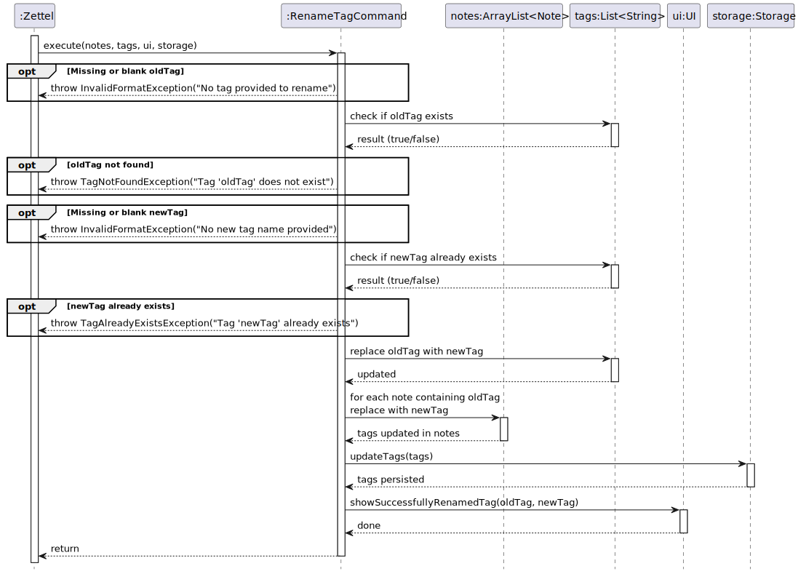

# Daniel Kwan — Project Portfolio Page

## Overview

ZettelCLI is a command-line Zettelkasten app for managing a personal knowledge base with speed and precision. It focuses on keyboard-first workflows such as creating, linking, tagging, filtering, and searching notes, with opinionated command formats and clear, consistent outputs.

My primary contributions centered on user-facing features for linking, pinning, finding and deleting, robust parsing and confirmation flows, and documentation that clearly explains formats and expected outputs.

## Summary of Contributions

### Code Contributed
- Dashboard (authorship) link: https://tinyurl.com/danielkwancs2113contributions

### Enhancements Implemented
- Tagging features
	- List tags on a single note: `list-tags <NOTE_ID>`.
	- List all tags globally: `list-tags-all`.
	- Delete a tag from a note (with confirmation and `-f` to force): `delete-tag [-f] <NOTE_ID> <TAG>`.
	- Delete a tag globally (with confirmation and cascading removal): `delete-tag-globally [-f] <TAG>`.
	- Rename a tag globally and update all affected notes: `rename-tag <OLD> <NEW>`.
- Linking features
	- Link notes (uni-directional) and unlink notes: `link`, `unlink`.
	- Link in both directions and unlink both sides: `link-both`, `unlink-both`.
	- List incoming/outgoing links directly: `list-incoming-links <NOTE_ID>`, `list-outgoing-links <NOTE_ID>`.
- Other user commands
	- Search notes: `find <TEXT>`.
	- Pin a note: `pin <NOTE_ID>`.
	- Print a note’s body: `print-body <NOTE_ID>`.

### Testing
- Added comprehensive JUnit tests for parser and commands, including:
	- Parser: direct commands for `list-incoming-links` and `list-outgoing-links`, list flags, tag operations, and `print-body`.
	- Command tests: delete tag (single note and globally) with confirmation/force flows, rename tag globally, unlink/link-both variants.

### Team-Based Contributions
- **Project Management**
	- Created, maintained, and assigned almost all issues on GitHub for iterations v2.0 and v2.1, ensuring clear task distribution and tracking across the team.
	- Managed team coordination on Telegram, including deadline announcements, milestone reminders, and progress check-ins.
	- Tracked feature progress and ensured timely completion of deliverables for each iteration.
- **Code Review and Quality Assurance**
	- Reviewed the majority of pull requests throughout v2.0 and v2.1, providing detailed feedback on code quality, design consistency, and potential bugs.
	- Caught and resolved numerous critical issues in PRs before merging, including incorrect error handling, inconsistent command formats, and storage serialization bugs.
    - Notable team PR reviews: https://github.com/AY2526S1-CS2113-W13-1/tp/pull/109 and https://github.com/AY2526S1-CS2113-W13-1/tp/pull/216
- **Code Contributions**
	- Implemented the largest number of features among team members, covering tagging, linking, searching, and deletion workflows.
	- Wrote the most lines of functional code due to the breadth and depth of implemented features, including complex bidirectional linking logic and global tag management.
- **Additional Support**
	- Completed the entirety of another team member's assigned work during v2.0 due to their unavailability, effectively handling two people's workload to ensure the iteration deadline was met.
- **Documentation Standardization**
	- Wrote Javadoc where necessary and refactored code to maintain a consistent style across the codebase (e.g., command message formats, parser validation messages, and UI output harmonization).
	- Ensured all implemented features were properly documented in both the User Guide and Developer Guide with clear examples and expected outputs.

### Notable Design/Implementation Highlights
- Parser consistency: standardized flag handling (`-p`, `-a`, `-f`) and error messages; added specific format strings to improve user feedback and testability.
- Safe destructive actions: added confirmation prompts for delete operations with `-f` bypass to support both safety and speed.
- Clear UI outputs: ensured commands report precise, actionable messages, including empty states and success summaries, to reduce user confusion.

### Contributions Beyond the Team Project
- **Bug Reporting**
	- Reported a total of 16 unique bugs during the Practical Exam Dry Run (PE-D), helping other teams identify and fix critical issues in their applications. https://github.com/nus-cs2113-AY2526S1/ped-danielkwan2004
	- Provided detailed reproduction steps and suggestions for fixes, contributing to the overall quality of peer projects.

### Documentation
- User Guide (UG)
	- Authored end-user sections and examples for: tagging (`new-tag`, `add-tag`, `list-tags`, `list-tags-all`, `delete-tag`, `delete-tag-globally`, `rename-tag`), linking (`link`, `unlink`, `link-both`, `unlink-both`, `list-incoming-links`, `list-outgoing-links`), searching (`find`), and printing note bodies (`print-body`).
	- Wrote the `list` command filters section with the pinned/archived matrix and updated examples; ensured help text matches runtime output.
- Developer Guide (DG)
	- Created UML diagrams for linking system architecture, including the Link Commands class diagram and Link Creation Sequence diagram, illustrating the bidirectional link tracking mechanism and command execution flow. Attached below are some of the diagrams I added.

