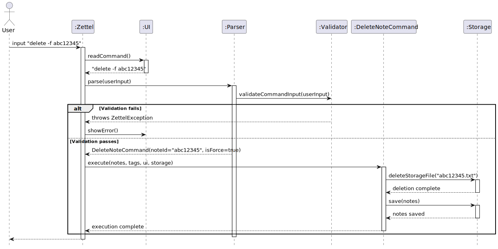

# Gordon - Project Portfolio Page

## Project: ZettelCLI

### Summary of Contributions

#### New Features / Enhancements

- **Storage Implementation**
    - What it does: Manages note persistence, repository structure, and validation of index and body files.
    - Justification: Ensures data integrity and recoverability, which are core for a reliable CLI note-taking system.
    - Highlights: Refactored from using an in-memory `ArrayList` to physical `.txt` files. Implemented archival, note deletion, and editing workflows. Ensured automatic recovery for missing or orphaned files.

#### Code Contributed

- Implemented `Storage.java` refactor after `v1.0`
- Developed note archival and editor integration features.
- Refactored note persistence from in-memory to file-based structure.
- [RepoSense link](https://nus-cs2113-ay2526s1.github.io/tp-dashboard/?search=&sort=groupTitle&sortWithin=title&timeframe=commit&mergegroup=&groupSelect=groupByRepos&breakdown=true&checkedFileTypes=docs~functional-code~test-code~other&since=2025-09-19T00%3A00%3A00&filteredFileName=&tabOpen=true&tabType=authorship&tabAuthor=gordonajajar&tabRepo=AY2526S1-CS2113-W13-1%2Ftp%5Bmaster%5D&authorshipIsMergeGroup=false&authorshipFileTypes=docs~functional-code~test-code~other&authorshipIsBinaryFileTypeChecked=false&authorshipIsIgnoredFilesChecked=false)

#### Contributions to UG

- Added usage instructions for note creation, deletion, linking, and tagging.
- Wrote examples and clarified edge cases in the User Guide.

#### Contributions to DG

- Wrote implementation details for storage, note creation, linking, archiving, and editor integration.
- Added some sequence UML diagrams:

#### Contributions to Team-Based Tasks

- Assisted teammates with debugging storage-related issues.
- Participated in weekly code reviews and merged PRs related to persistence features.
- Suggested design improvements for note ID generation and file storage structure.

#### Review / Mentoring Contributions

- Reviewed pull requests from teammates, focusing on code correctness and adherence to design patterns.

#### Contributions Beyond the Team

- Reported potential improvements and minor bugs observed in other teams' projects.

#### Tools / Libraries Integrated

- Used Java NIO for robust file system operations.
- Leveraged external editors via `$EDITOR` / `$VISUAL` environment variables for note editing.

