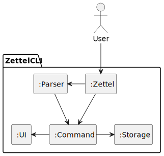
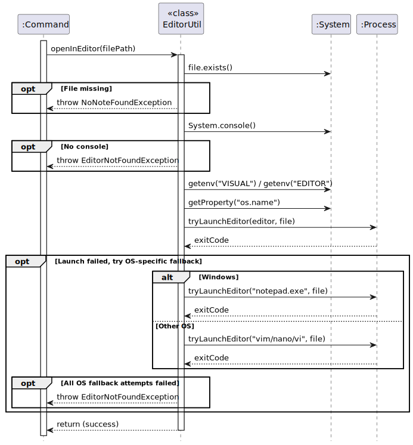
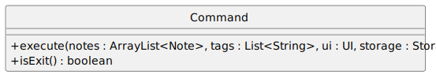
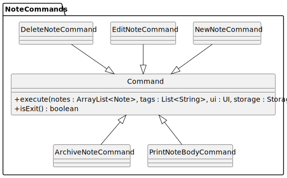

# Shaun - Project Portfolio Page

## Project: ZettelCLI

### Code Contributed
Contribution: [RepoSense Link](https://nus-cs2113-ay2526s1.github.io/tp-dashboard/#/widget/?search=&sort=groupTitle&sortWithin=title&timeframe=commit&mergegroup=&groupSelect=groupByRepos&breakdown=true&checkedFileTypes=docs~functional-code~test-code~other&since=2025-09-19T00%3A00%3A00&filteredFileName=&chartGroupIndex=14&chartIndex=3)

### Summary of Contributions

#### Tag Management
I contributed to the implementation of tag management functionality in the Zettel note-taking system, enabling both 
global tag management and per-note tagging. Functionalities include:

1. Global Tag Initialisation and Synchronisation
- Implemented logic to validate and maintain the global `tags.txt` file on system startup.
- Checks tags from all existing notes across repositories and updates tags list to ensure consistency between each 
repository's `index.txt` and `tags.txt`.

2. Global Tag Creation (`NewTagCommand`)
- Adds a new tag to the global list of tags
- Validates tags from user inputs
- Checks for duplicates
- Updates storage of tags in `tags.txt`

#### Repository Management
I also contributed to the repository management, enabling users to
store notes in multiple repositories. Functionality includes

1. Initialisation of Repository (`InitRepoCommand`)
- Validates the repository does not already exist
- Updates the list of repositories in `.zettelConfig`

### Reviewing/mentoring contributions
I helped in reviewing PRs for my group, ensuring that it is up to standard. This 
includes code correctness, and abiding by the coding standards set by our group.

PRs include
- [Feature: Add single link between any 2 notes](https://github.com/AY2526S1-CS2113-W13-1/tp/pull/86)
- [Feature: list all incoming and outgoing notes](https://github.com/AY2526S1-CS2113-W13-1/tp/pull/87)
- [Bugfix: new validator class to parse out invalid inputs](https://github.com/AY2526S1-CS2113-W13-1/tp/pull/207)

### Helping in Team Tasks
- Maintaining level of code coverage by adding test cases
- Participated in group discussions to decide features and their high level implementations.
### Developer Guide Contributions
I contributed to the DG in the form of the UML Diagrams. These includes class diagrams, and sequence diagrams. 
Attached below are some of the diagrams I added.

